# Secret-Key Encryption Lab

## Introduction / Lab Definition

This lab dives into secret-key encryption, a fundamental aspect of modern cybersecurity. Throughout the lab, I explore various encryption algorithms, their operational modes, and how they can be susceptible to attacks. The purpose of this lab is to provide hands-on experience with encryption concepts, allowing me to grasp the importance of secure communication in our digital age. The primary objectives of this lab are: first, to understand the mechanics behind secret-key encryption; second, to investigate common vulnerabilities and mistakes developers might make when implementing these algorithms; and third, to apply this knowledge by conducting practical experiments.

By the end of the lab, I not only learn how to encrypt and decrypt messages but also develop critical thinking skills to analyze and exploit potential weaknesses in encryption methods. It includes tasks such as frequency analysis (breaking a monoalphabetic substitution cipher), playing with different ciphers and modes using OpenSSL, examining how padding works in block ciphers, comparing the behavior of various encryption modes, exploring error propagation and IV mistakes, and writing a program to brute-force a weak encryption key.

---

# Part 1

## Task 1: Frequency Analysis

In this lab, the objective is to perform a frequency analysis on a given ciphertext to decipher a message encrypted using a simple substitution cipher. Frequency analysis is a technique often used in cryptography to break substitution ciphers by analyzing the frequency of letters in the encrypted text and comparing them to the expected frequencies of letters in the language of the original plaintext. The goal of this lab is to demonstrate an understanding of basic cryptographic techniques and how they can be circumvented using statistical analysis.

I began by using the `frequency_analysis.py` script available on Blackboard to generate a random key and create `ciphertext.txt` from the original ciphertext given in Blackboard. I ran the script, which generated a random encryption key crucial for mapping each letter of the alphabet to a different letter in the ciphertext. After generating the key, I used it to create `ciphertext.txt` based on the provided original ciphertext.

To prepare the ciphertext for analysis, I applied two `tr` commands to convert all uppercase letters to lowercase and to remove all punctuation and numbers, while retaining the spaces between words to maintain word boundaries. Following the text processing, I used the `freq.py` script provided in the lab setup files. This script analyzed the processed text in `ciphertext.txt` to create a substitution table based on the frequency of letter occurrences, comparing them to typical letter frequencies in English.

<p float="left">
  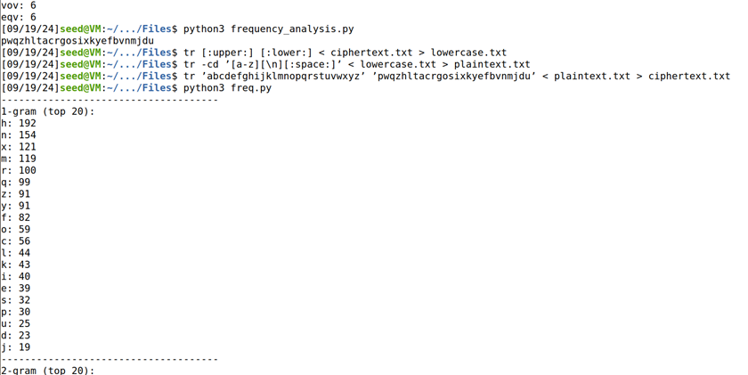
  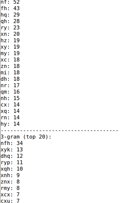
</p>

I then modified and utilized a Python script to calculate the frequency of n-grams (with n = 2 and n = 3). The objective was to analyze common patterns in the ciphertext based on common digraphs (two-letter sequences) and trigraphs (three-letter sequences) in the English language. This n-gram analysis helped to refine the decryption process by identifying common sequences and mapping them to their corresponding plaintext equivalents.

<p float="left">
  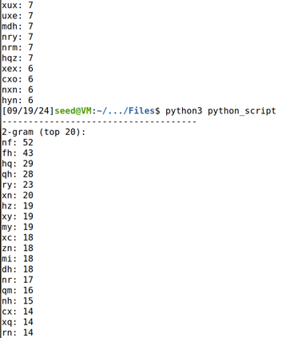
  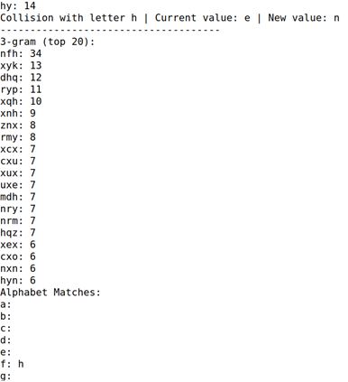
</p>
<p float="left">
  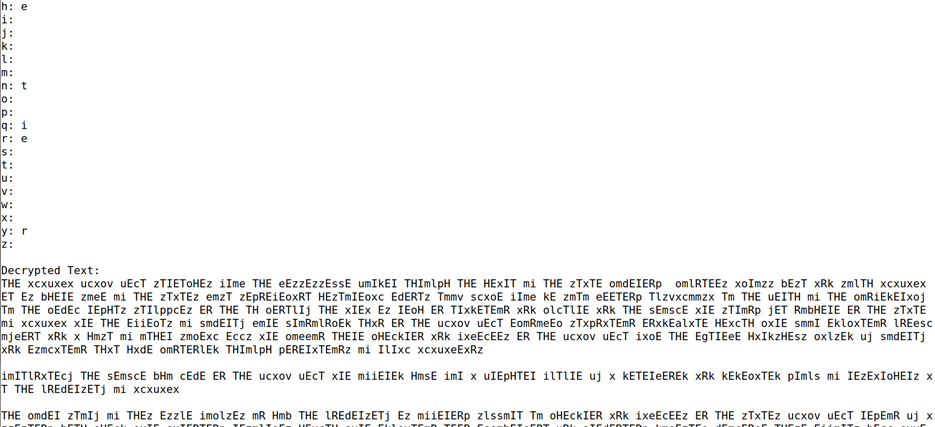
  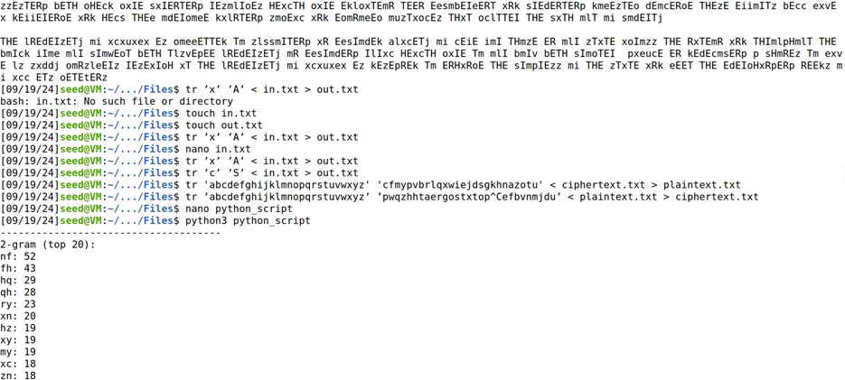
</p>

After generating the substitution table using `freq.py`, I further analyzed the ciphertext using a modified Python script, which processed the ciphertext and produced a partially decrypted `plaintext.txt`.

One of the first key findings was that the n-gram `"nfh"` corresponded to the word `"THE."` This was a significant breakthrough, as it provided a starting point for deciphering other letters in the ciphertext.

Through careful frequency analysis and trial-and-error mapping, I began to decode additional letters one by one. For instance, I discovered that the letter `"x"` was mapped to `"A."` This mapping allowed me to look for potential words that could fit within the context of the message.

As I continued my analysis, I recognized that in the second word of the partially decrypted text, the sequence was `"ALABAMA."` This further confirmed the mappings I had made and highlighted the effectiveness of using frequency analysis in conjunction with known words to decipher the plaintext.

The process of mapping letters and recognizing common English words allowed me to gradually decode the remaining portions of the ciphertext. To analyze the partially decrypted text and refine my understanding of the letter mappings, I utilized a `tr` command to process the output from the file `in.txt` and generate a new file called `out.txt`. This command allowed me to transform the ciphertext into a more manageable format, making it easier to visually compare the letter substitutions and assess which combinations made sense in English.

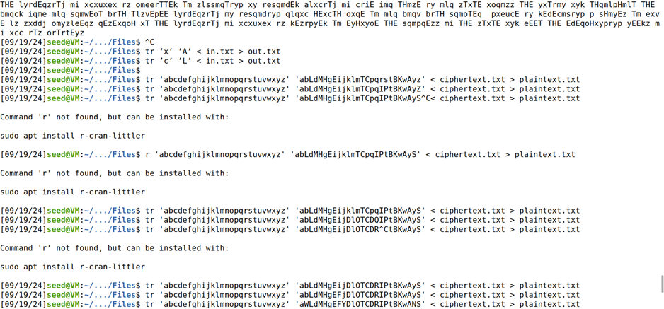

In addition to working with the `in.txt` and `out.txt` files, I took the time to manually map out each letter in Visual Studio Code. This hands-on approach allowed me to visualize the relationships between the ciphertext characters and their potential plaintext counterparts. However, I encountered some challenges during this process, primarily because I was initially referencing the original `ciphertext.txt` instead of the newly generated text based on the encryption key.

This oversight led to some confusion, as I tried to match letters without considering the adjustments made by the frequency analysis and substitution process. To overcome this, I shifted my focus to the modified text, writing down the mappings manually as I analyzed the letter frequencies. After several iterations and careful consideration, I finally derived the complete key:

```
HWLVMHXEFYDUOTCGRIPZBKTANS
```

This key was the foundation for decrypting the remaining ciphertext and understanding the plaintext message hidden within it.

<p float="left">
  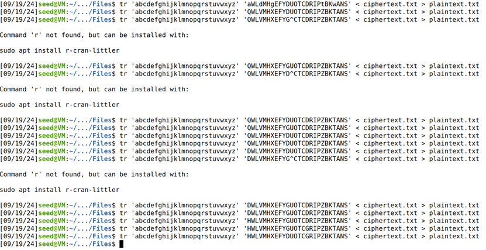
  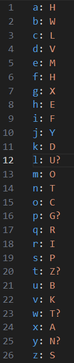
</p>

---

## Task 2: Encryption using Different Ciphers and Modes

In Task 2, I explored various encryption algorithms and modes using the `openssl enc` command. This involved encrypting and decrypting files with different cipher types, such as `aes-128-cbc`, `bf-cbc`, and `aes-128-cfb`. By utilizing specific command-line options, I learned how to manage encryption keys and initialization vectors, enhancing my understanding of how different ciphers function in securing data.

<p float="left">
  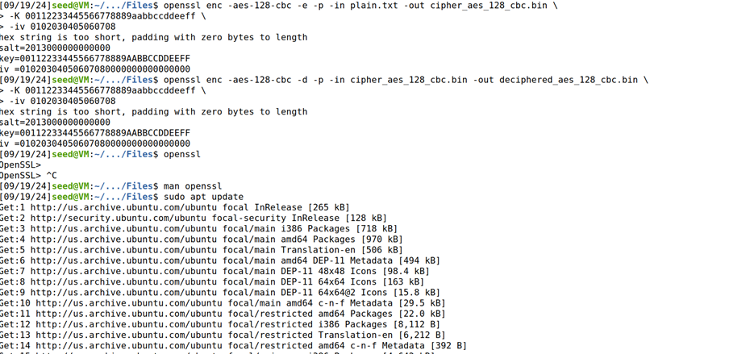
  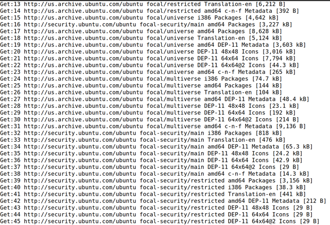
</p>

To begin my work with encryption, I first needed to ensure that OpenSSL was installed on my system. I used the command `sudo apt-get install openssl` to install OpenSSL, which required administrative privileges. This command allowed me to download and install the OpenSSL package, enabling me to access various cryptographic functions and command-line tools essential for performing encryption and decryption tasks.

I used the command:
```
openssl enc -aes-128-cbc -d -p -in cipher_aes_128_cbc.bin -out deciphered_aes_128_cbc.bin
```
to decrypt a file that had been previously encrypted using the AES-128-CBC cipher. The `-d` option indicated that I wanted to perform decryption, while the `-p` option displayed the encryption key and initialization vector (IV) used during the encryption process. By specifying the input file (`cipher_aes_128_cbc.bin`) and the output file (`deciphered_aes_128_cbc.bin`), I was able to retrieve the original plaintext from the encrypted binary file, demonstrating the effectiveness of the AES-128-CBC algorithm in secure data management.

<p float="left">
  
  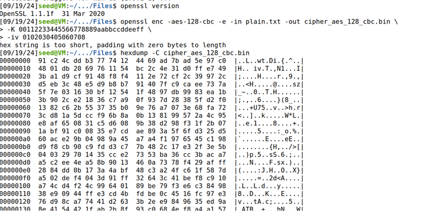
  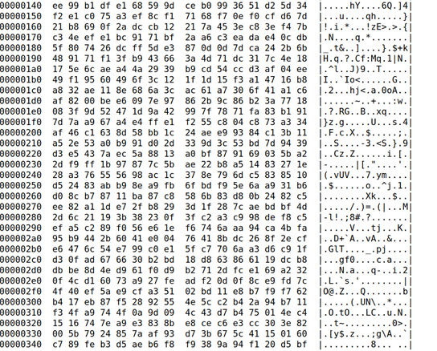
</p>
<p float="left">
  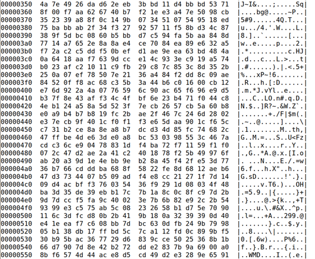
  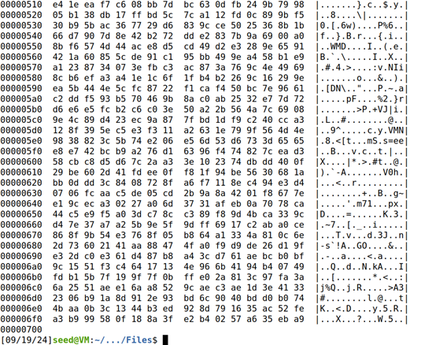
</p>

I explored encryption using various algorithms and modes by utilizing the `openssl enc` command. I started by familiarizing myself with the command syntax and the different cipher types available by consulting the OpenSSL manuals (`man openssl` and `man enc`).

I then began experimenting with three different cipher types: `aes-128-cbc`, `bf-cbc`, and `aes-128-cfb`. For each cipher, I created an encrypted output file from a plaintext file (`plain.txt`) using the following command format:

```
openssl enc -ciphertype -e -in plain.txt -out cipher.bin -K 00112233445566778889aabbccddeeff -iv 0102030405060708
```

After performing the encryption and decryption using OpenSSL, I observed that the result in the output file matched the original text, confirming it worked correctly. In the Cipher Block Chaining mode, each encryption operation involves an initial step where the plaintext block is XORed with the Initialization Vector. This means that both the plaintext block and the IV need to be of the same length. Since I used the Advanced Encryption Standard, the plaintext blocks are always 128 bits long. The IV is padded with zero bytes until it reaches the required length of 128 bits (16 bytes).

On the other hand, when using the Blowfish cipher, the IV is only 8 bytes long, which aligns with the size specified in the command. This means no additional padding is necessary for the Blowfish cipher, allowing it to operate directly with the IV as provided. This distinction between the two algorithms highlights the importance of understanding the specific requirements for block sizes and IV lengths when working with different encryption methods.

---

## Task 3: Encryption Mode — ECB vs. CBC

In Task 3, I found the differences between encryption modes by encrypting a simple image file, `pic_original.bmp`, using both Electronic Code Book and Cipher Block Chaining modes. The objective was to prevent unauthorized users from accessing the image content without the encryption keys. To properly visualize the encrypted images, we needed to address the BMP file format's structure, where the first 54 bytes contain header information essential for image rendering. I used the Bless hex editor to modify the binary files, specifically by replacing the header of the encrypted image with that of the original image.

I started by encrypting the original image, `pic_original.bmp`, using the Electronic Code Book mode:

```
openssl enc -aes-128-ecb -e -p -in pic_original.bmp -out pic_ecb_enc.bmp
```

This command encrypted the entire image file, including the crucial first 54 bytes that make up the BMP header. However, to properly display the encrypted image, I needed to retain the original header and only cipher the data starting from the 55th byte onward. Following the lab manual's instructions, I extracted the header from the original image using:

```
head -c 54 pic_original.bmp > header
```

Then, I obtained the body of the encrypted image (the data from byte 55 to the end):

```
tail -c +55 pic_ecb_enc.bmp > body
```

Finally, I combined the original header with the encrypted body to create a new BMP file that could be displayed correctly:

```
cat header body > pic_ecb.bmp
```

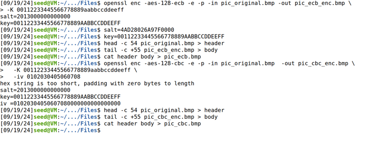

For the encryption using the Cipher Block Chaining (CBC) mode, I followed a similar approach but with a few adjustments. I began by executing:

```
openssl enc -aes-128-cbc -e -p -in pic_original.bmp -out pic_cbc_enc.bmp \
  -K 00112233445566778889aabbccddeeff \
  -iv 0102030405060708
```

This command encrypted the original image while specifying a key and an initialization vector (IV). The output indicated that the hex string was too short, prompting OpenSSL to pad it with zero bytes, ensuring the key and IV met the required lengths. Next, I extracted the header from the original BMP file the same way, obtained the body of the encrypted image starting from byte 55, and combined them: `cat header body > pic_cbc.bmp`. To display the encrypted picture, I used the installed image viewer program `eog` on my VM: `eog pic_ecb.bmp`, `eog pic_cbc.bmp`.

For an additional experiment, I selected a different image, `all_gray.bmp`, which is a uniformly gray picture, and followed the same encryption procedures. When I displayed `all_gray_ecb.bmp` using `eog`, I noticed that the image appeared to show patterns rather than being completely uniform — this is ECB mode, where identical plaintext blocks result in identical ciphertext blocks.

Next, I encrypted the same image using CBC mode and again replaced the header. I found that the image was less recognizable compared to the ECB result. The encryption with CBC mode added more randomness to the output, hindering any patterns that might have been present in the original image.

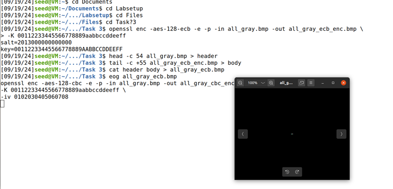

---

## Task 4: Padding

For this task, I played with the concept of padding in block ciphers, specifically focusing on the PKCS#5 padding scheme. The objective was to understand how different encryption modes handle plaintext that is not a multiple of the block size. I started encrypting a file using various modes, including ECB, CBC, CFB, and OFB, to identify which required padding and which did not.

Next, I created three files of varying lengths — 5 bytes, 10 bytes, and 16 bytes — using the `echo -n` command. Initially, I didn't create the three files needed for the task, so I looked up how to do so, and discovered that `echo -n` would allow me to create files of specific lengths without automatically adding a newline character.

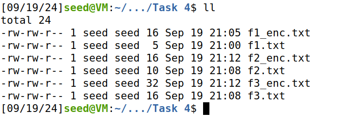

I then encrypted these files with AES in CBC mode and analyzed the sizes of the encrypted outputs to observe how padding was applied.

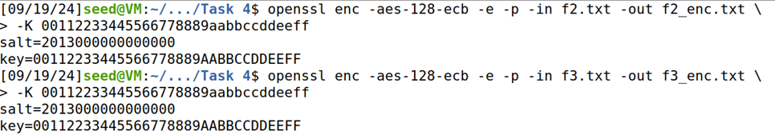

When using the ECB mode to encrypt the 5-byte file, the resulting encrypted file size was 16 bytes, indicating that 11 bytes were added during the encryption process. However, the total size of the original plaintext and the encrypted file combined was 28 bytes. This shows the original 5 bytes, the 16 bytes from the encrypted output, and the additional 7 bytes of padding necessary to meet the block size requirement.

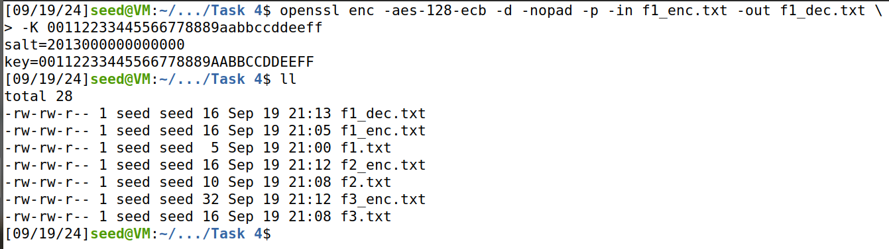

I used the `-nopad` option during decryption, which allowed me to view the raw data, including the padding, using hex tools like `hexdump` and `xxd`. This process provided insight into how padding is utilized in block cipher encryption and its impact on the resulting ciphertext.

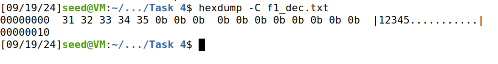

I then observed that it had 11 bytes of padding after using the `hexdump` command, represented as `0x0b`, equaling the value 11.

---

# Part 2

## Task 5: Error Propagation — Corrupted Cipher Text

First and foremost, I will answer the question: *"How much information can you recover by decrypting the corrupted file, if the encryption mode is ECB, CBC, CFB, or OFB, respectively? Please answer this question before you conduct this task, and then find out whether your answer is correct or wrong after you finish this task. Please provide justification."*

**My prediction (before testing):** ECB would allow me to recover a significant amount of data since it encrypts each block independently — while I might encounter some repetitive patterns due to identical plaintext blocks being encrypted to the same ciphertext, a considerable portion of the data could still be decrypted. In contrast, CBC relies on each block of plaintext being XORed with the previous ciphertext block, so corruption in a ciphertext block would affect both that block and the subsequent one, leading to a greater loss of information compared to ECB. CFB has a similar structure to CBC, so corruption in a ciphertext block would impact both that block and the next. Finally, OFB stands out since its encryption does not depend on the plaintext or previous ciphertext — even if a ciphertext block is corrupted, it should only affect that specific block, allowing the rest of the data to be decrypted correctly. Overall, I expected to recover the most information in ECB, followed by OFB, with CBC and CFB providing the least due to their chaining properties.

In Task 5, I created a plaintext file consisting of over 1000 bytes of text, which served as the input for my encryption tasks.

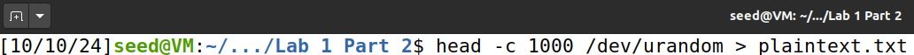

I then utilized the OpenSSL command-line tool to explore the four encryption modes: ECB, CBC, CFB, and OFB. I executed the following OpenSSL commands to encrypt the file using each cipher mode:

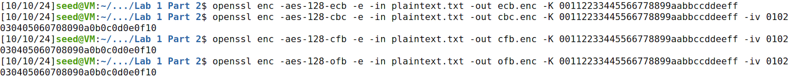

Continuing with the use of the Bless hex editor for each of the four cipher modes, I analyzed how modifying the ciphertext impacted the decryption results. I opened the `ecb.enc`, `cbc.enc`, `cfb.enc`, and `ofb.enc` files in Bless and navigated to the 55th byte for each. Using Bless's editing features, I flipped the value of each byte by one bit.

<p float="left">
  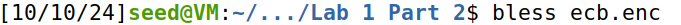
  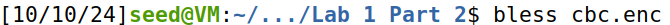
</p>
<p float="left">
  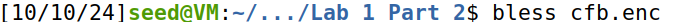
  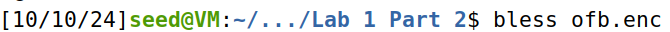
</p>
<p float="left">
  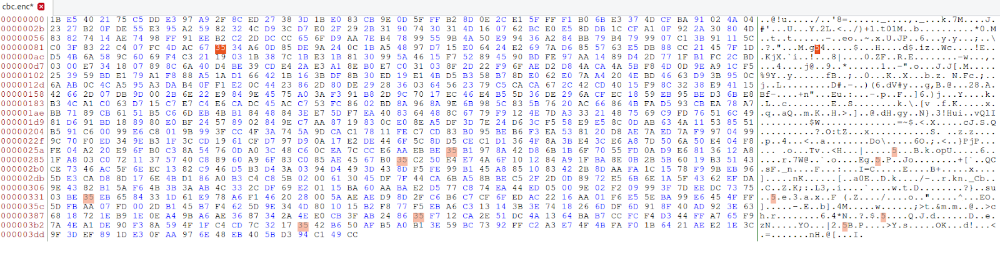
  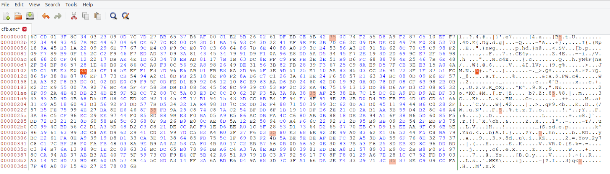
</p>
<p float="left">
  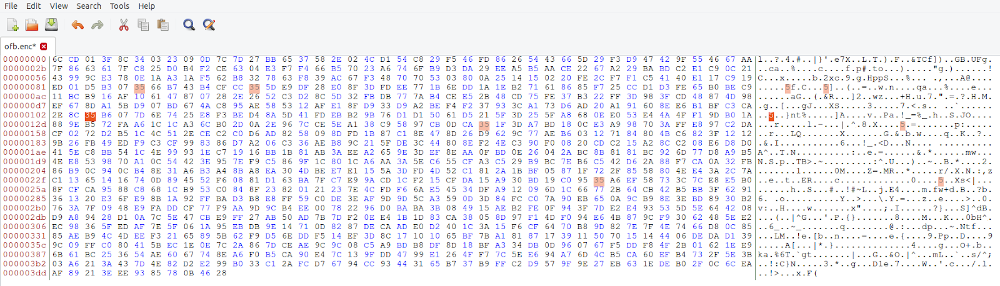
  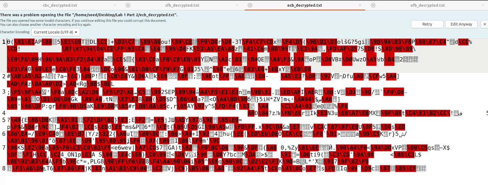
</p>

**Results — ECB:** Upon reviewing the decrypted output for ECB, I noted that only the byte corresponding to the corrupted ciphertext was affected. This outcome confirmed the property of ECB mode where corruption affects only the corresponding block, revealing its vulnerability to localized errors.

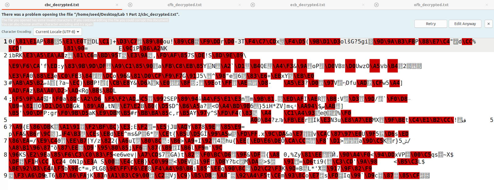

**Results — CBC:** The results showed that not only the corrupted byte was affected but also the subsequent byte in the plaintext. This observation illustrated the chaining effect characteristic of CBC mode, where an error in one block influences the decryption of the next block, leading to a broader corruption.

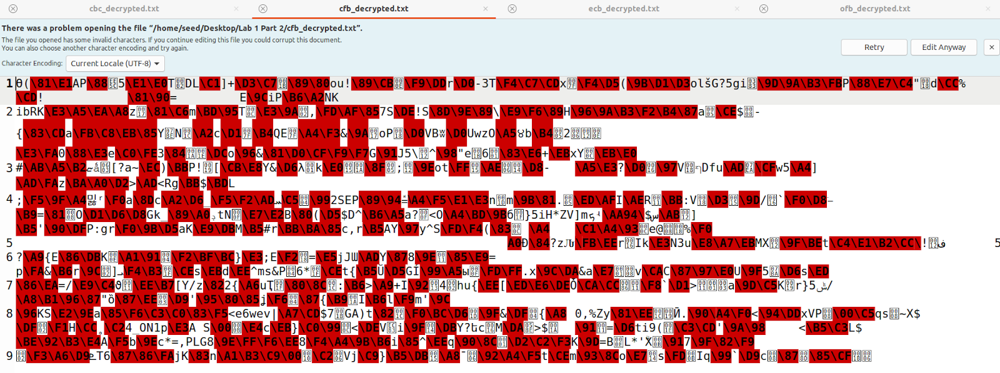

**Results — CFB:** The decryption results indicated that, similar to ECB, only the corresponding byte in the plaintext was affected. This confirmed that while CFB mode allows for more flexibility in error propagation compared to ECB, it still limits the corruption to the affected byte.

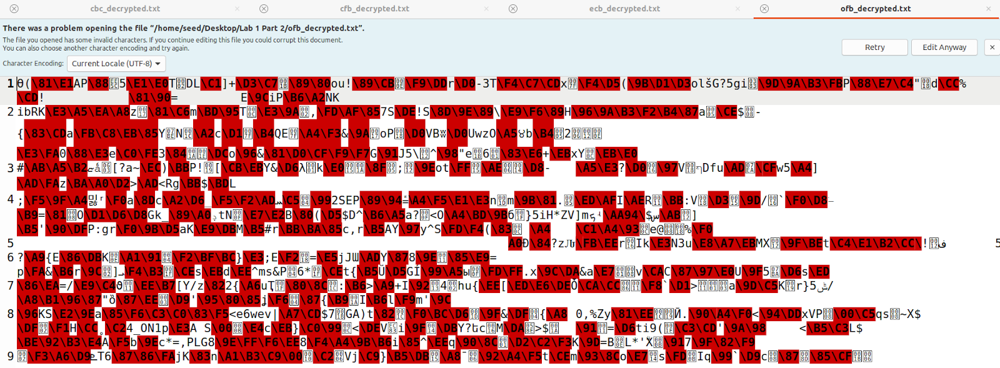

**Results — OFB:** The output revealed that there was no significant change to the decrypted plaintext beyond the corrupted byte. This resilience to corruption demonstrated the unique nature of OFB mode, which does not propagate errors beyond the affected bit.

Through these experiments with the Bless hex editor, I gained firsthand experience with how each cipher mode responds to ciphertext modifications. The findings highlighted the varying levels of error propagation inherent to each mode, underscoring the importance of selecting appropriate encryption methods based on the specific security needs of an application.

---

## Task 6: Initialization Vector (IV) and Common Mistakes

**Task 6.1:** Most encryption modes require an initialization vector (IV). The properties of an IV depend on the cryptographic scheme used. If we are not careful in selecting IVs, the data encrypted by us may not be secure at all, even though we are using a secure encryption algorithm and mode. The objective of this task is to help understand the problems that arise if an IV is not selected properly. A basic requirement for an IV is uniqueness — no IV may be reused under the same key.

**Task 6.2:** To understand why, I encrypted the same plaintext using (1) two different IVs, and (2) the same IV.

<p float="left">
  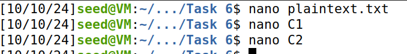
  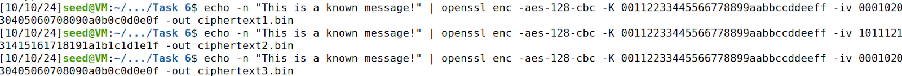
</p>

After running the above commands, I viewed the ciphertext outputs using the following commands:

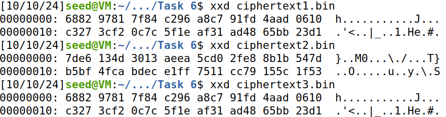

The ciphertexts from `ciphertext1.bin` and `ciphertext2.bin` were different, despite using the same plaintext. This outcome demonstrated that the different IVs alter the encryption process's starting point, leading to distinct ciphertext outputs. The ciphertext from `ciphertext3.bin` was identical to that of `ciphertext1.bin`. This repetition shows that reusing the same IV with the same key and plaintext resulted in the same ciphertext.

The requirement for IV uniqueness comes from the principle of ensuring that the same plaintext does not encrypt to the same ciphertext under the same key. When IVs are reused, several risks emerge. First, if an IV is predictable or reused, attackers can correlate identical plaintexts and their ciphertexts, undermining the effectiveness of the encryption scheme and allowing them to infer relationships between multiple messages. Additionally, if an attacker knows both the plaintext and the ciphertext associated with that IV, they can exploit this information to decrypt other ciphertexts. This vulnerability is made worse in modes like OFB and CFB, where IVs significantly impact the encryption process. Unique IVs help ensure that the same plaintext produces different ciphertexts, thus preserving confidentiality and complicating any potential cryptanalysis attempts.

One may argue that if the plaintext does not repeat, using the same IV is safe. However, to show the risks involved, I went through the Output Feedback (OFB) mode. The objective was to determine whether an attacker could decrypt other encrypted messages if the IV is always the same.

I used the same plaintext file containing the message `"This is a known message!"`. To perform XOR operations on the ciphertexts, I converted the hex values to byte arrays. The following Python code snippet demonstrates this conversion, based on the code provided in the lab manual:

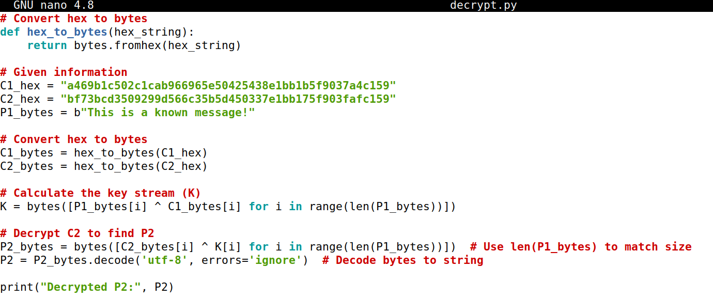

With the key stream (K) calculated, I decrypted C2 to determine the unknown plaintext (P2) using the same XOR operation. I saved the above code into a Python file named `decrypt.py`. Running the code in the terminal produced the following output:

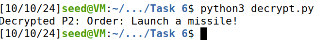

**Task 6.3:** In this task, we aimed to explore the implications of using predictable initialization vectors (IVs) in encryption schemes. The objective was to demonstrate how a predictable IV can expose the contents of encrypted messages to potential attackers.

Initially, I attempted to connect to the encryption oracle provided for the task, which simulates Bob encrypting messages using 128-bit AES in CBC mode. Unfortunately, I faced difficulties when trying to establish a connection to the oracle. The error message indicated that the "destination host was unreachable," preventing me from accessing the encryption service as instructed.

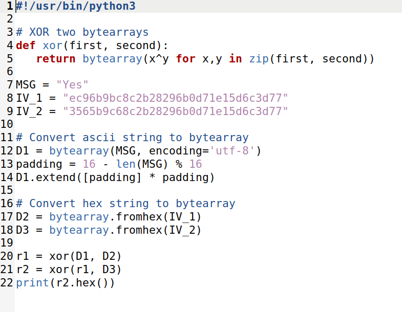

To overcome this challenge, I consulted a guide that outlined an alternative method using a Python script. This script was designed to perform the encryption using the given parameters and demonstrated how predictable IVs could compromise message security. When executed, the script produced the following output:

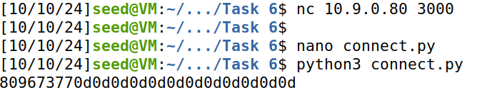

It became evident that using predictable IVs poses significant security risks. Even though the encryption algorithm, such as AES, is robust, predictable IVs allow attackers to potentially decipher the encrypted messages if they can guess or infer the plaintext. Employing secure, randomly generated IVs in encryption schemes is very important to maintain the confidentiality and integrity of sensitive information.

---

## Task 7: Programming using the Crypto Library

The objective of Task 7 was to find the key used in an AES-128-CBC encryption scheme. We were given the ciphertext, initialization vector (IV), and plaintext, and we knew that the key was an English word shorter than 16 characters. To complete the task, we had to write a program that utilizes the OpenSSL library to decrypt the ciphertext by brute-forcing the key from a word list. I was provided with the following plaintext and ciphertext:

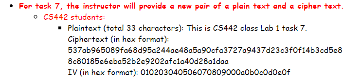

Initially, I attempted to write a Python script for the task, but I encountered an issue with no output being generated, likely due to an issue in my script implementation. After resolving that, I switched to using a C program with the OpenSSL library, as the task specifically required utilizing this library. Since the provided ciphertext and IV were in hexadecimal format, the first step was to convert them into byte arrays that could be passed to the OpenSSL decryption functions. I found a C program that utilized the OpenSSL library for AES-128-CBC decryption. The program attempts to decrypt the ciphertext using each word in the word list as the potential key. Each word was padded with `#` characters if it was shorter than 16 bytes. The code below shows how I implemented the decryption process using the OpenSSL EVP functions:

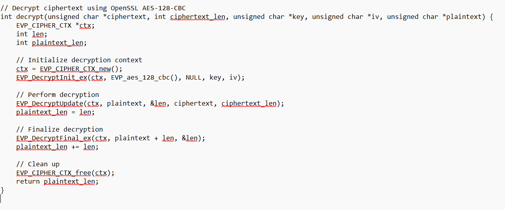

The program iterated over every word in the `words.txt` file. For each word, the key was constructed by appending `#` symbols to make it 16 bytes long. The program then attempted to decrypt the ciphertext with the generated key. If the resulting plaintext matched the expected value (`"This is CS442 class Lab 1 task 7."`), the correct key was found.

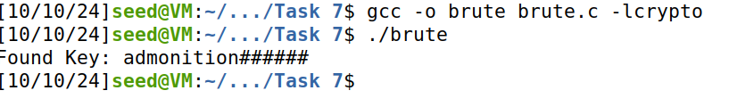

---

## Conclusion

In this lab, I explored several cryptographic techniques and gained practical experience in encryption and decryption using ciphers such as AES-128-CBC, focusing on vulnerabilities and practical considerations of encryption.

In **Task 1**, I performed frequency analysis on a substitution cipher, generating a random encryption key and analyzing the ciphertext to uncover the plaintext message. This hands-on experience showed the importance of frequency patterns in cryptography and improved my understanding of substitution ciphers.

**Task 2** involved experimenting with different encryption algorithms using OpenSSL. I successfully encrypted and decrypted files with AES in both ECB and CBC modes, gaining insights into the differences in encryption processes and their implications for data security.

In **Task 3**, I applied encryption techniques to image files, comparing the visual results of ECB and CBC modes. This task illustrated how different encryption methods can affect the appearance of encrypted data and emphasized the need for careful consideration of encryption choices.

**Task 4** focused on padding schemes in block ciphers. I learned about the PKCS#5 padding scheme and conducted experiments to observe the effects of padding on file sizes, gaining a deeper understanding of how padding ensures proper alignment with block sizes during encryption.

In **Task 5**, I examined how bit errors propagate through ECB, CBC, CFB, and OFB modes, confirming my predictions about which modes contain corruption to a single block versus which propagate it further.

**Task 6** highlighted the critical importance of proper IV selection, demonstrating through hands-on experiments how reused or predictable IVs can compromise the confidentiality of encrypted messages, even when using a secure cipher like AES.

In **Task 7**, I wrote a brute-force program using the OpenSSL library to find the encryption key for a given ciphertext. By automating this process and testing possible key candidates from an English word list, I was able to successfully decrypt the message. This task reinforced the importance of using strong, unpredictable keys in encryption to prevent brute-force attacks.

Overall, this lab provided a comprehensive overview of cryptographic concepts, from breaking weak substitution ciphers to understanding the practical steps required to strengthen modern cryptographic systems.

---

## References

1. X. Yang, "CS 428/528/442/542 Lab requirements."
2. seed-labs, "seed-labs/category-crypto/Crypto_Encryption/Labsetup/Files/freq.py at master · seed-labs/seed-labs," *GitHub*, 2020. https://github.com/seed-labs/seed-labs/blob/master/category-crypto/Crypto_Encryption/Labsetup/Files/freq.py (accessed Sep. 20, 2024).
3. "SEED Labs - Secret-Key Encryption Lab." Available: https://seedsecuritylabs.org/Labs_20.04/Files/Crypto_Encryption/Crypto_Encryption.pdf
4. 2dukes, "Seed-Labs_Write-Ups/Cryptography/secret-key-encryption/secret-key-encryption-lab.md at main · 2dukes/Seed-Labs_Write-Ups," *GitHub*, 2022. https://github.com/2dukes/Seed-Labs_Write-Ups/blob/main/Cryptography/secret-key-encryption/secret-key-encryption-lab.md (accessed Oct. 11, 2024).

