# Pseudo-Random Number Generation (PRNG) Lab

## Introduction / Lab Definition

In modern computing, the generation of random numbers is fundamental to various applications, particularly in security and cryptography. Randomness is crucial for tasks such as secure key generation, encryption, and creating unique identifiers, where predictable outcomes can lead to vulnerabilities and potential exploitation. This lab focuses on exploring the mechanisms employed by Linux systems to generate and manage randomness, particularly through the use of entropy sources and random number devices.

The lab consists of a series of tasks designed to investigate the behavior of two primary random number generators in Linux: `/dev/random` and `/dev/urandom`. I measure the entropy available in the kernel, analyze the implications of blocking behavior in `/dev/random`, and assess the quality of pseudo-random numbers generated by `/dev/urandom`. By employing various Linux commands and tools, I gain insights into the effectiveness and reliability of these random number generators in practical scenarios, thereby enhancing my understanding of their role in secure computing environments.

---

## Task 1: Generate Encryption Key in a Wrong Way

In this task, I examined the importance of setting a random seed for generating pseudo-random numbers, particularly for encryption key generation.

I started by running the provided C program with the `srand(time(NULL));` function included. This function uses the current time as the seed for the random number generator, ensuring a unique seed each time the program runs.

The output included the current time in seconds since the Epoch and a 16-byte hexadecimal encryption key, which varied each time I ran the program. I captured a screenshot of the output for this run to illustrate how the time-based seed influenced the encryption key.

<p float="left">
  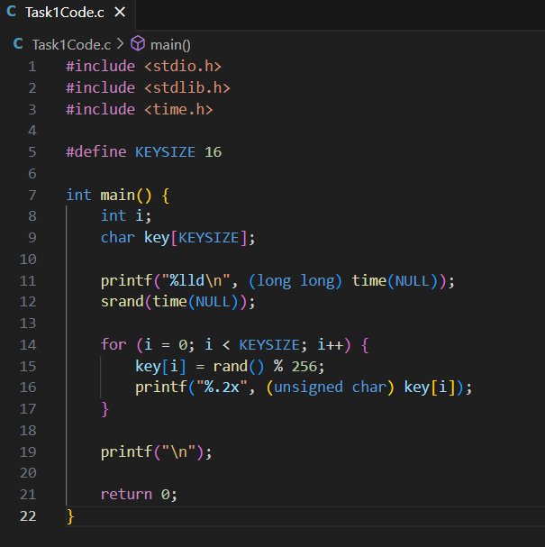
  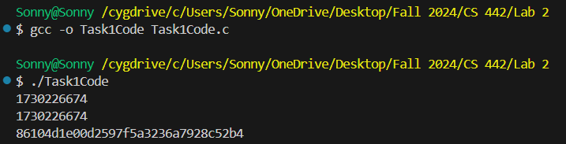
</p>

Next, I commented out the `srand(time(NULL));` line and ran the program again. Without the time-based seed initialization, the random number generator used its default seed, leading to the same encryption key sequence on each execution.

I captured a screenshot of this output as well, to show the impact of not seeding the generator with a time-dependent value.

<p float="left">
  
  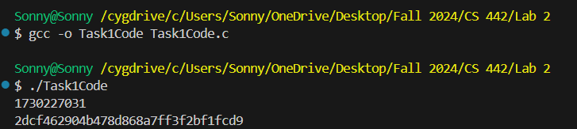
</p>

Based on my observations, I concluded that using `srand(time(NULL));` allows the program to generate a different encryption key each time it's run, which is essential for security. Without this seeding step, the generated key sequence is predictable, making it unsuitable for encryption purposes.

---

## Task 2: Guessing the Key

Alice, the CEO of a major company, encrypted her tax return PDF file using a key generated from a random number generator that was seeded with the current epoch time. When Bob, an unauthorized user, obtained the encrypted file, he attempted to retrieve the key by exploring the possible time values used for seeding the random number generator. In this report, I outline the process I followed to implement a brute-force solution for key recovery.

To find the appropriate epoch time range for seeding the random number generator, I used the `date` command in Unix-based systems. This command helps convert human-readable date and time formats into epoch time, which counts the seconds since January 1, 1970. For example, to convert Alice's encryption date and time to epoch, I executed:

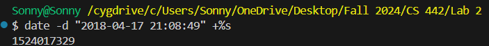

To generate potential encryption keys, I modified a C program to iterate through a range of epoch times, seeding the random number generator for each value. Below is the modified code:

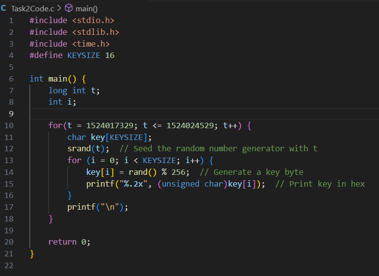

I compiled the program using the GCC compiler and redirected the output to a file named `keys.txt` to store the generated keys.

<p float="left">
  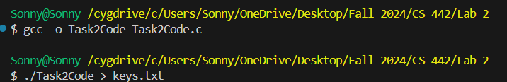
  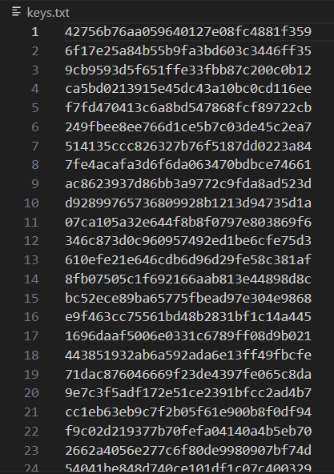
</p>

Next, I wrote a Python script to read the generated keys from `keys.txt` and test each key against the known plaintext and IV to find a matching ciphertext. Below is the Python code I used:

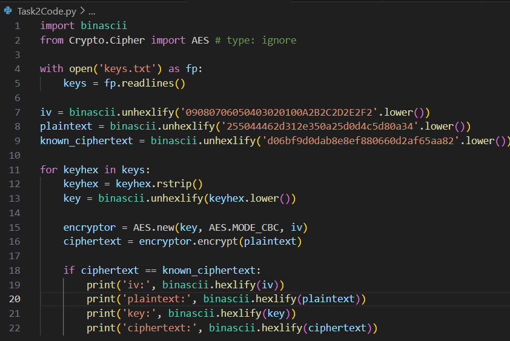

After executing the Python script, I successfully found the matching key. The output displayed the IV, plaintext, key, and corresponding ciphertext.

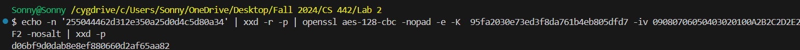

---

## Task 3: Measure the Entropy of the Kernel

In this task, I explored how Linux systems generate and manage randomness through kernel entropy. Unlike theoretical entropy in information theory, the entropy measured in the kernel represents the amount of randomness available to the system, quantified in bits. This randomness is crucial for cryptographic operations and other processes that rely on unpredictability. The kernel maintains a measure of available entropy, which can be checked using the command:

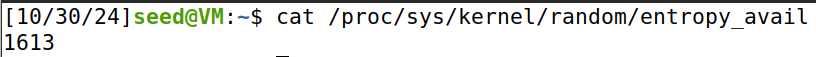

To monitor entropy over time, I used the `watch` command, allowing me to observe changes in entropy levels every 0.1 seconds:

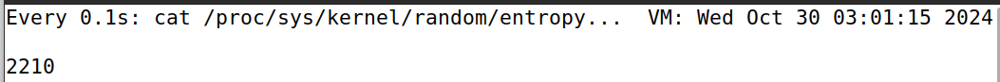

While the command was running, I engaged in various activities to observe their impact on the system's entropy level. Here's a summary of the activities performed and their observed effects: I typed characters in a text file, moved my mouse around, and read a large file.

<p float="left">
  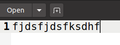
  
  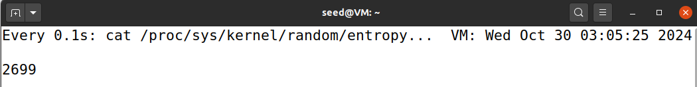
</p>

The experiment demonstrated that physical interactions with the system, such as mouse movements and clicks, significantly enhance the kernel's entropy levels. Activities that involve network or disk I/O may contribute to randomness, but not to the same extent as direct user input through keyboard and mouse actions. Understanding these sources of entropy is vital for enhancing the security and reliability of cryptographic functions within the system.

---

## Task 4: Get Pseudo-Random Numbers from `/dev/random`

In this task, I detail the experiments conducted to measure kernel entropy in a Linux environment and observe the behavior of the `/dev/random` device. The primary objectives were to monitor how entropy levels change with user interactions and to investigate the blocking nature of `/dev/random`.

To monitor the entropy available in the kernel, I used the following command, which reads the current entropy level:

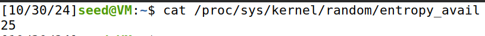

I also utilized the `watch` command to refresh the output every 0.1 seconds:

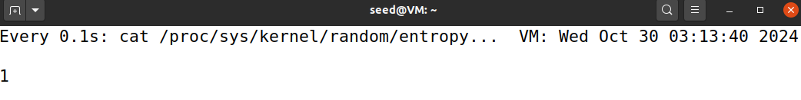

To read pseudo-random numbers from `/dev/random`, I executed the following command, formatting the output with `hexdump` for clarity:

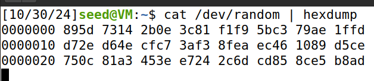

When I ran the entropy monitoring command without any user interaction, I noticed that the entropy count began to decrease steadily. As entropy levels dropped, the output from `/dev/random` also slowed down and eventually stopped once the entropy reached zero. The `/dev/random` device is designed to provide high-quality random numbers but operates as a blocking device. When there is insufficient entropy, it will halt output until more entropy is available.

This blocking behavior is crucial for applications requiring strong randomness for cryptographic purposes. If a server relies on `/dev/random` to generate session keys, it could be susceptible to a DoS attack by overwhelming it with requests for random data, depleting the entropy pool. Once the pool is empty, legitimate clients would experience significant delays or even failures in establishing connections.

The experiment successfully demonstrated the relationship between user interaction and kernel entropy, as well as the behavior of the `/dev/random` device in a Linux environment. Understanding these principles is critical for ensuring the reliability and security of cryptographic systems.

---

## Task 5: Get Random Numbers from `/dev/urandom`

In this report, I describe the experiment to access random numbers from the `/dev/urandom` device in a Linux environment. I evaluated the behavior of `/dev/urandom`, tested the quality of the generated random numbers, and modified a code snippet to produce a 256-bit encryption key.

To generate pseudo-random numbers from `/dev/urandom`, I executed the following command, which formatted the output using `hexdump`:

```
cat /dev/urandom | hexdump
```

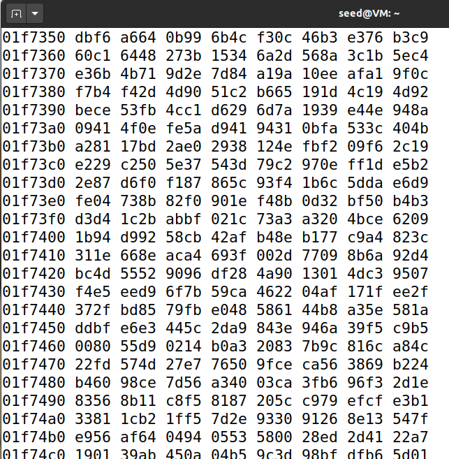

Next, I generated 1 MB of pseudo-random numbers and saved them to a file named `output.bin`. Then, I used the `ent` tool to analyze the quality of the random numbers:

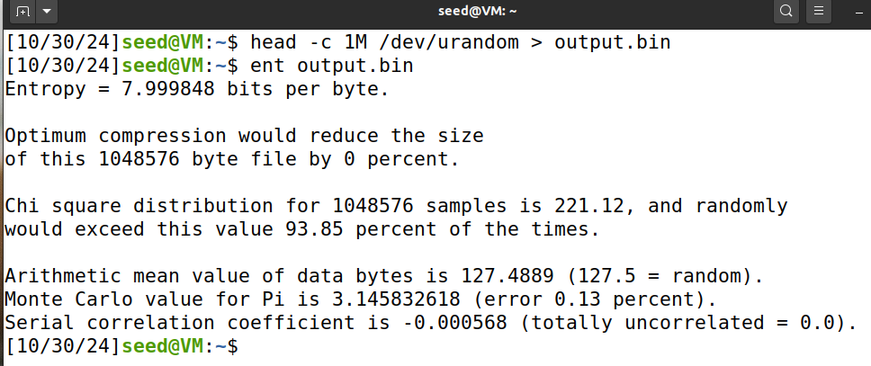

To generate a 256-bit encryption key, I modified the provided code snippet from 128 bits to 256 bits. The modified code is as follows:

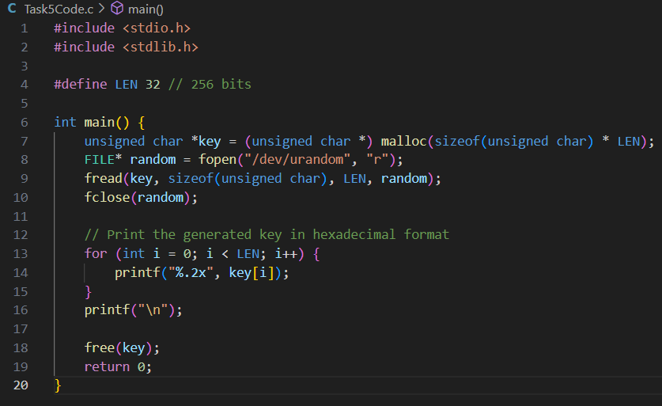

The screenshot below shows the generated 256-bit encryption key printed in hexadecimal format:

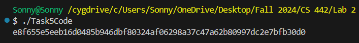

When executing the command to read from `/dev/urandom`, I observed that moving the mouse or interacting with the system had no observable effect on the output. The `/dev/urandom` device continuously generated random bytes regardless of system activity, indicating its non-blocking nature.

The `ent` tool provided various metrics, including: **Entropy**, indicating the randomness in the data; **chi-square test**, measuring the distribution of bytes; and **monobit test**, evaluating the proportion of ones and zeros. The results suggested that the quality of the random numbers generated from `/dev/urandom` was good, showing acceptable entropy levels and statistical distribution.

The modified code successfully generated a 256-bit encryption key. By increasing the `LEN` definition from 16 to 32 bytes (128 to 256 bits), the program reads 32 bytes from `/dev/urandom`, ensuring a strong and secure key suitable for encryption purposes. The key is printed in hexadecimal format for clarity.

The experiment successfully demonstrated the effective use of `/dev/urandom` for generating non-blocking pseudo-random numbers. The quality of the generated random numbers was validated using the `ent` tool, and a modified code snippet was provided to generate a secure 256-bit encryption key. Using `/dev/urandom` is recommended for applications requiring reliable randomness without the risk of blocking behavior associated with `/dev/random`.

---

## Conclusion

This lab provided a comprehensive exploration of random number generation within Linux systems, focusing on the critical roles of entropy and the functionality of the `/dev/random` and `/dev/urandom` devices. Through a series of hands-on tasks, I examined the sources of entropy utilized by the Linux kernel, revealing how physical events such as keyboard inputs and mouse movements contribute to the randomness required for secure operations.

I observed the blocking nature of `/dev/random` and its potential impact on system performance, particularly in high-demand environments where rapid random number generation is essential. Conversely, the non-blocking behavior of `/dev/urandom` demonstrated its practicality for generating pseudo-random numbers without compromising system responsiveness, although with considerations regarding entropy levels.

Additionally, my assessment of the quality of random numbers produced by these devices underscored the reliability of `/dev/urandom` in practical applications, despite the theoretical advantages of `/dev/random`. This lab reinforced the importance of randomness in cryptographic practices and highlighted the trade-offs between security and performance in the context of random number generation. Ultimately, a deeper understanding of these concepts is vital for enhancing the security posture of computing systems and ensuring the integrity of cryptographic processes.

---

## References

1. X. Yang, "CS 428/528/442/542 Lab requirements."
2. Write, "Write a Python or C program to guess the key," *Information Security Stack Exchange*, Mar. 06, 2020. https://security.stackexchange.com/questions/226935/write-a-python-or-c-program-to-guess-the-key (accessed Oct. 30, 2024).
3. "SEED Project," *seedsecuritylabs.org*. https://seedsecuritylabs.org/Labs_20.04/Crypto/Crypto_Random_Number/
