# RSA Lab

## Introduction / Lab Definition

The RSA cryptosystem is a fundamental component of modern public-key cryptography, widely used for secure communication through encryption and digital signatures. This lab provides a comprehensive hands-on experience to enhance one's understanding of RSA by bridging theoretical knowledge with practical implementation. Using the OpenSSL library, I engage in tasks that involve key generation, encryption, decryption, signature creation, and verification, as well as certificate validation. These exercises reinforce key concepts such as big number arithmetic and public-key cryptography, while also offering insights into real-world cryptographic applications.

In this lab, I complete six tasks to explore the RSA algorithm in depth. The first task focuses on deriving the private key `d` from given primes `p`, `q`, and the public exponent `e`, highlighting the mathematical foundations of RSA. The second task involves encrypting a plaintext message using the public key `(e, n)`, demonstrating the process of securing data for transmission. In the third task, I decrypt a provided ciphertext using the private key, reinforcing the duality between public and private key operations. The fourth task requires generating a digital signature for a given message and analyzing how message modifications affect the signature, showcasing RSA's role in ensuring data integrity. The fifth task focuses on verifying a digital signature using a public key, with an emphasis on evaluating the impact of corrupted signatures. Finally, the sixth task integrates RSA principles into real-world applications by manually verifying an X.509 certificate, extracting relevant fields, and validating the issuer's signature.

---

## Task 1: Deriving the Private Key

The objective of this task was to compute the RSA private key *d* using the given prime numbers *p*, *q*, and *e*. The private key *d* is derived using the formula:

```
d ≡ e⁻¹ mod φ(n)
```

where `n = p × q`, `φ(n) = (p−1) × (q−1)`, and `e` is the public exponent.

The hexadecimal values for the primes `p`, `q`, and the public exponent `e` are as follows:

```
p = F7E75FDC469067FFDC4E847C51F452DF
q = E85CED54AF57E53E092113E62F436F4F
e = 0D88C3
```

The implementation was achieved through a C program that utilized OpenSSL functions for arithmetic operations on large integers. The results were printed to the terminal, showing the values of `n`, `φ(n)`, and `d`.

<p float="left">
  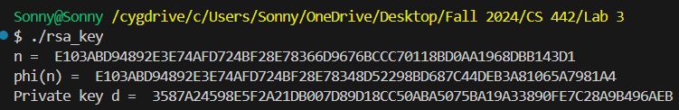
  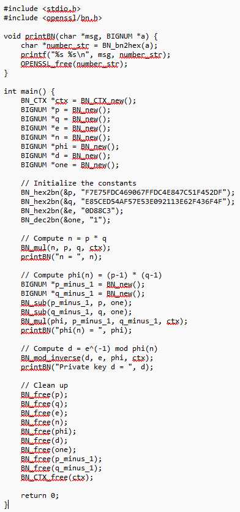
</p>

> **Note:** the paragraphs below appear to be duplicated from a different lab (they describe `srand(time(NULL))` seeding rather than the RSA private-key derivation above) and the text is cut off mid-sentence in the source document. Recommend replacing this section with the actual Task 1 write-up/analysis of the `d`, `n`, `φ(n)` results shown in the screenshots above.

I started by running the provided C program with the `srand(time(NULL));` function included. This function uses the current time as the seed for the random number generator, ensuring a unique seed each time the program runs.

The output included the current time in seconds since the Epoch and a 16-byte hexadecimal encryption key, which varied each time I ran the program. I captured a screenshot of the output for this run to illustrate how the time-based seed influenced the encryption key.

<p float="left">
  
  
</p>

Next, I commented out the `srand(time(NULL));` line and ran the program again. Without the time-based seed initialization, the random number generator used its default seed, leading to the same encryption key sequence on each execution.

I captured a screenshot of this output as well, to show the impact of not seeding the generator with a time-dependent value.

<p float="left">
  
  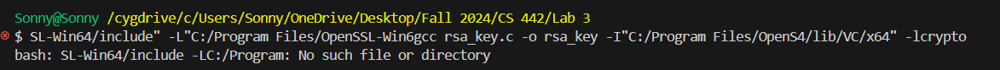
</p>

Based on my observations, I concluded that using `srand(time(NULL));` allows the program to generate a different encryption key each time it's run, which is essential for security. Without this seeding step, the generated key sequence is predictable, making it unsuitable for encryption purposes.

---

## Task 2: Encrypting a Message

In Task 2 of the RSA lab, I was asked to encrypt the message `"A top secret!"` using the provided public key and then decrypt it using the private key. This task involved converting the message into a hex string, using OpenSSL's `BN_hex2bn()` function to work with the message as a BIGNUM, and applying RSA encryption and decryption formulas. The primary goal was to observe the RSA encryption process and verify that the decrypted message matches the original.

To complete the task, I began by converting the plaintext message `"A top secret!"` into its hexadecimal representation. Using a Python script, I executed the following command:

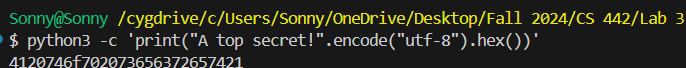

This resulted in the hex string `"4120746f702073656372657421"`, which was then used as input for the encryption and decryption process.

I then wrote a C program that used OpenSSL's BIGNUM library to perform the encryption and decryption operations. The program utilized the following steps: the public key components `e` (exponent) and `n` (modulus) were provided in hexadecimal format, and the private key component `d` was also given. Using OpenSSL's `BN_hex2bn()` function, I converted the hexadecimal values for `m` (the message), `e`, `n`, and `d` into BIGNUMs. The encryption was performed using the formula `m^e mod n`, where `m` is the message, `e` is the public exponent, and `n` is the modulus. The decryption was performed using the formula `enc^d mod n`, where `enc` is the encrypted message and `d` is the private exponent.

<p float="left">
  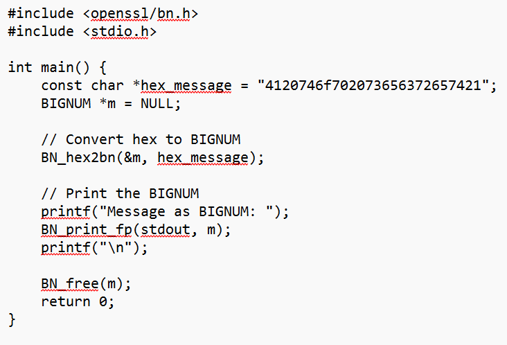
  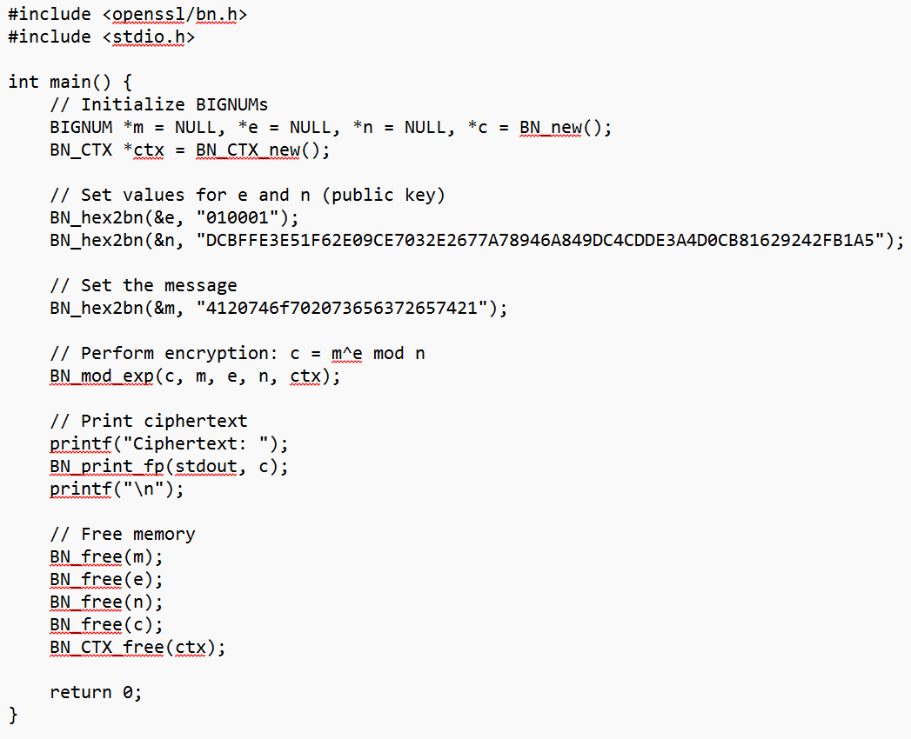
</p>

I encountered some issues during the compilation process. Specifically, I faced errors related to linking the OpenSSL libraries. These errors indicated that `-lcrypto` and `-lssl` could not be found. I resolved this by ensuring that I correctly pointed to the OpenSSL libraries in my system, specifically the path to `libcrypto.lib` and `libssl.lib`. However, I continued to receive warnings about missing OpenSSL dependencies, which were resolved later.

During the initial compilation, I struggled with several issues. The main problem I encountered was my inability to link the OpenSSL libraries correctly. Specifically, I kept seeing errors indicating that the linker couldn't find `-lcrypto` and `-lssl`, even though I had pointed to the correct library paths. I then found a C program that successfully completed Task 2, named `hextobn.c`, in my files folder.

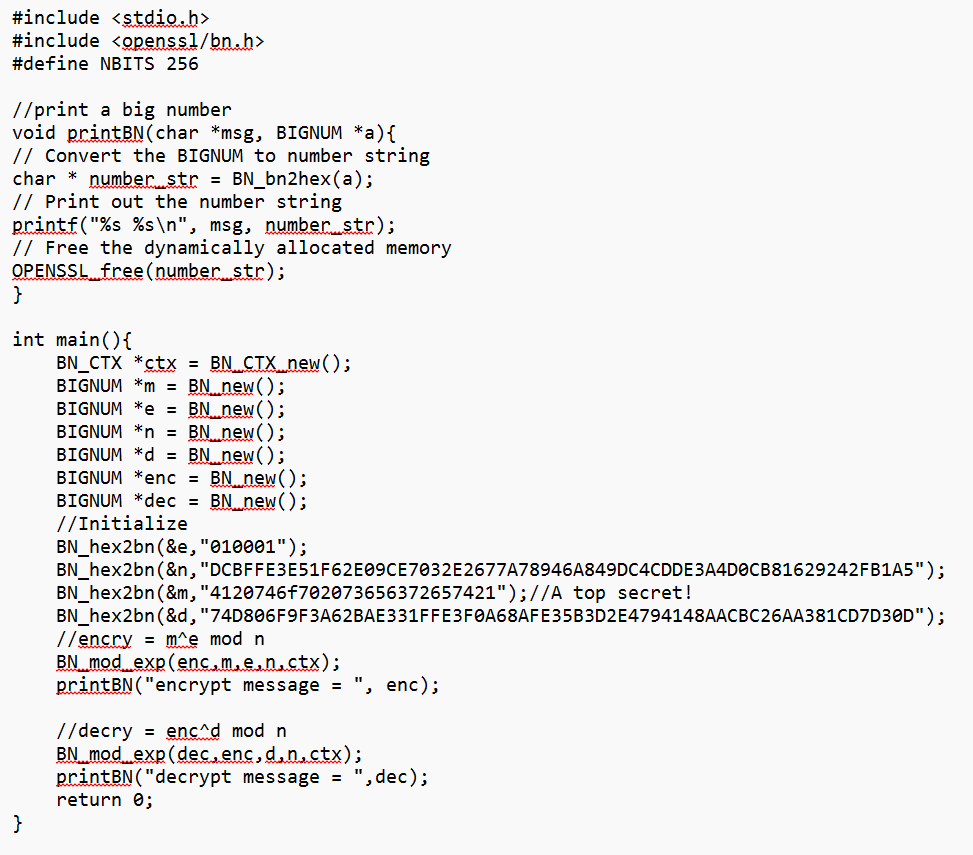

Once these issues were resolved, the program compiled successfully, and I was able to run it and observe the results. Upon running the compiled code, I obtained the following outputs. The encrypted message, after applying the public key for encryption (`m^e mod n`), was:

```
6FB078DA550B2650832661E14F4F8D2CFAEF475A0DF3A75CACDC5DE5CFC5FADC
```

After applying the private key for decryption (`enc^d mod n`), the decrypted message was:

```
4120746F702073656372657421
```

When converted back to ASCII, the decrypted hex string `4120746F702073656372657421` corresponds to the original message `"A top secret!"`, confirming that the encryption and decryption were successful.

The task was successfully completed after resolving initial compilation issues. The RSA encryption and decryption processes worked as expected, and the decrypted message matched the original input. Through this process, I gained practical experience with OpenSSL's BIGNUM library and learned how to handle library linking and permissions in Cygwin while working with external libraries like OpenSSL. Despite the challenges with linking the libraries, the exercise was valuable in understanding the underlying mathematics behind RSA encryption and how to implement it programmatically using OpenSSL's BIGNUM functions.

---

## Task 3: Decrypting a Message

In this task, I was required to decrypt a ciphertext `C` using the private key `d` and modulus `n` that were provided in Task 2. The goal was to recover the original plaintext message by applying the RSA decryption formula. Once decrypted, I converted the resulting ciphertext back into an ASCII string. To begin with, I utilized the same public and private keys from Task 2. For the decryption, I wrote a C program using the OpenSSL library. The code initializes the ciphertext `C`, private key `d`, and modulus `n`, then performs the decryption.

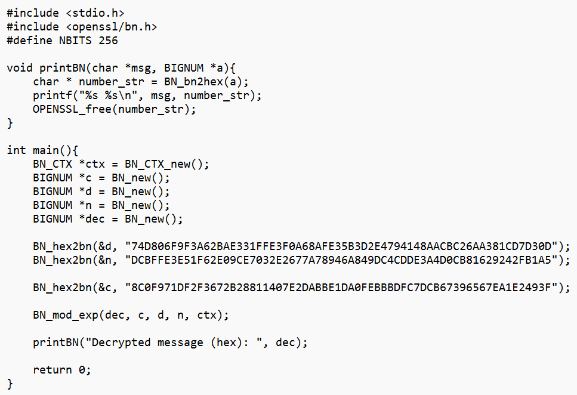

The next step was to compile the code using the OpenSSL libraries, ensuring that I linked the appropriate `-lcrypto` and `-lssl` libraries. The compilation command I used was:

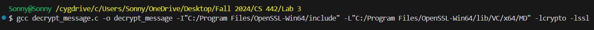

When I ran the decryption program, the output was displayed as a hexadecimal string. The hexadecimal result of the decryption was:

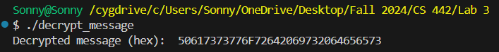

To convert the decrypted message from hexadecimal to ASCII, I used a Python command to decode the hex string:

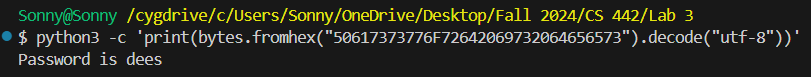

---

## Task 4: Signing a Message

The objective of this task is to generate a digital signature for a given message using RSA encryption and compare the signatures when a slight modification is made to the message. The message `"I owe you $2000"` will first be signed using the private key, and then a slight change will be made to the message (changing `$2000` to `$3000`) before signing it again. The two signatures will then be compared to observe how a small change in the message results in a completely different signature.

The original message `M = "I owe you $2000"` is signed using the private key `d` and the modulus `n` provided in the previous tasks. The RSA signature is computed using the formula `signature = M^d mod n`. The message is first converted into a BIGNUM, then the modular exponentiation is performed to obtain the signature.

After obtaining the signature for the original message, I modified the message slightly by changing `$2000` to `$3000`, resulting in the new message `M' = "I owe you $3000"`. The modified message is then signed using the same private key `d` and modulus `n`.

The two signatures are printed in hexadecimal format. A comparison of both signatures is done to observe how a small change in the message leads to a completely different signature. This behavior is expected due to the nature of RSA signing, where even a minor modification in the message alters its hash, thereby changing the signature.

The program I used for signing the messages is in C, using the OpenSSL library for the RSA encryption and signature generation.

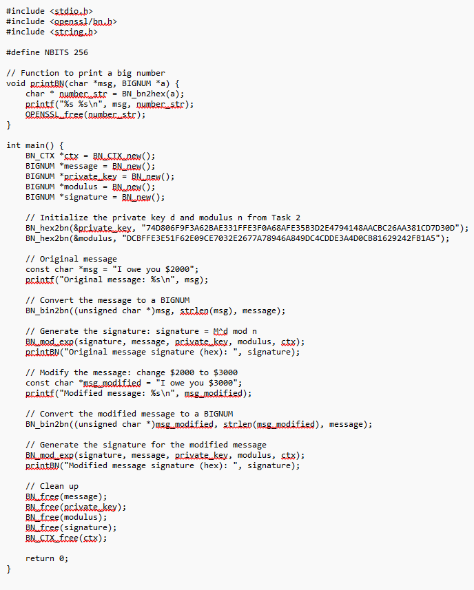

After successful compilation, I executed the program, which generated the signatures for both the original and modified messages.

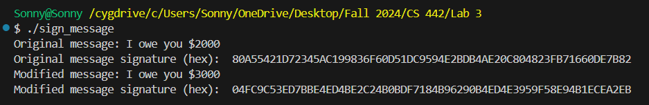

---

## Task 5: Verifying a Signature

The objective of this task was to verify the authenticity of a digital signature received from Alice for a message `M = "Launch a missile."` using her public key. The task also involved analyzing the effect of a corrupted signature, where a single byte of the signature was altered, and observing the impact on the verification process. Digital signatures are a core component of modern cryptographic protocols, ensuring both the integrity and authenticity of a message. In this task, I used Alice's public key to verify a message's signature, ensuring that it was indeed signed by Alice. I then intentionally corrupted the signature by modifying one byte to observe how small changes in the signature affect the verification process.

The public key `(e, n)` and the signature `S` were provided as hexadecimal strings:

```
M = "Launch a missile."
S = 643D6F34902D9C7EC90CB0B2BCA36C47FA37165C0005CAB026C0542CBDB6802F
e = 010001 / 65537
n = AE1CD4DC432798D933779FBD46C6E1247F0CF1233595113AA51B450F18116115
```

To verify the signature, the signature `S` was raised to the power of `e` (Alice's public exponent) modulo `n` (Alice's modulus). This is the core of RSA signature verification. If the result of this operation matches the message `M`, then the signature is valid. Otherwise, it is invalid.

The verification was implemented using OpenSSL's BIGNUM library, which allows the handling of large numbers necessary for RSA operations. The code used modular exponentiation (`BN_mod_exp`) to reconstruct the signed message from the signature.

After verifying the original signature, the task required modifying the last byte of the signature from `2F` to `3F`. This simulated a corrupted signature. The modified signature was then verified in the same manner as the original signature.

The original signature was verified using the public key, and the result was compared to the message. In the case of the corrupted signature, a mismatch was expected, as even a single-bit change in the signature invalidates it.

The original signature was successfully verified using the public key. The result showed that the reconstructed message matched the original message, confirming the authenticity and integrity of the message and its signature.

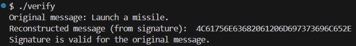

After modifying the last byte of the signature, the verification failed. The reconstructed message from the corrupted signature did not match the original message, indicating that the signature had been tampered with. This demonstrates how RSA signatures are highly sensitive to any change in the signature data, ensuring message integrity.

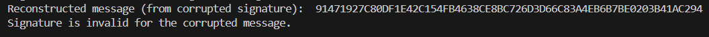

The results clearly show the behavior of RSA signatures during verification. When the original signature was used, the verification process succeeded, confirming the message's authenticity. However, after a single byte of the signature was corrupted, the verification process failed, indicating that even the slightest change in the signature data invalidates the verification. This highlights the importance of the integrity of both the signature and the signed message. This behavior is an essential feature of RSA signatures. A digital signature is designed to be sensitive to any modifications, ensuring that tampered messages cannot pass verification without detection. In practice, this ensures the security of digital communication by preventing unauthorized modifications. In this task, I successfully verified a message's digital signature using RSA. I also observed the effects of corrupting the signature, where even a small alteration caused the verification process to fail. This demonstrates the robustness of RSA digital signatures in ensuring data integrity and authenticity. Through this exercise, I reinforced the importance of securing both the signature and the signed message in cryptographic protocols.

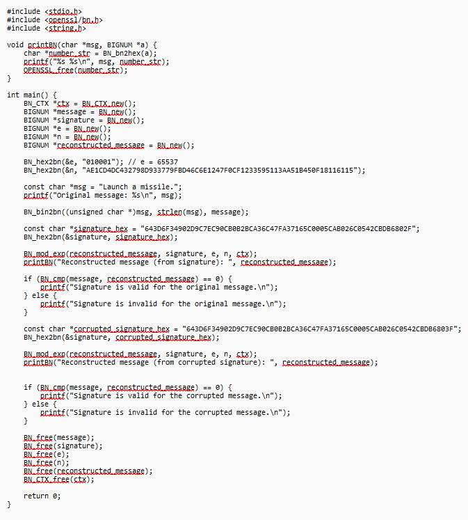

---

## Task 6: Manually Verifying an X.509 Certificate

This task involved verifying the authenticity of an X.509 certificate by manually implementing the signature verification process. I downloaded the server certificate, extracted the public key from the certificate's issuer, and used this key to verify the signature. Throughout the task, I faced challenges in verifying the signature due to various formatting and technical issues. Despite troubleshooting and attempting multiple approaches, including using both Python and C for verification, the signature ultimately failed to validate.

In this task, the goal was to manually verify an X.509 certificate by extracting the necessary elements, including the issuer's public key, signature, and certificate body, and using the RSA algorithm to confirm the validity of the certificate's signature. This process required downloading a certificate from a web server, extracting public key parameters, and performing signature verification. Throughout the task, I faced difficulties with the signature verification process, which led to concluding that the signature was invalid.

The first step of the task was to download the certificate from a web server. I selected a different web server than the one suggested in the task description, as instructed, and used the following OpenSSL command to retrieve the certificate:

<p float="left">
  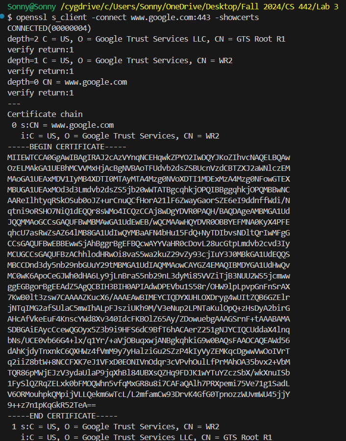
  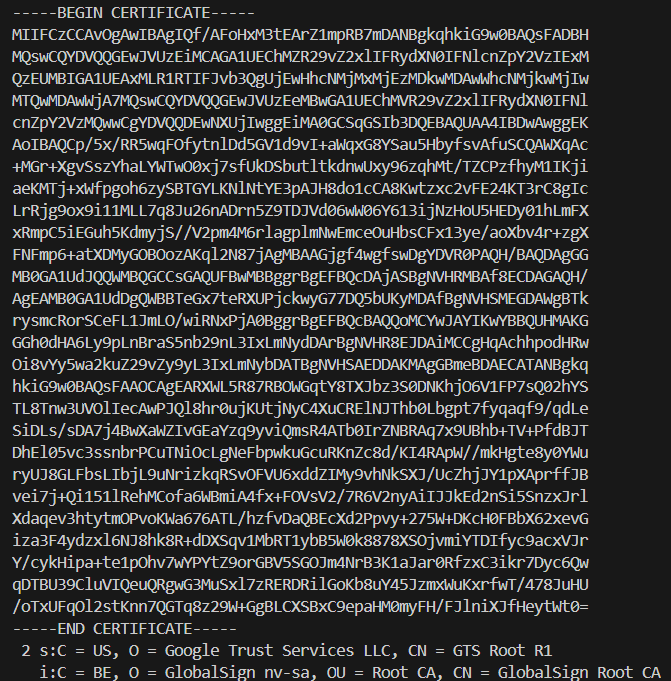
</p>

This command provided two certificates: one for the server and one for the issuer (the Certificate Authority). The issuer's certificate was essential for obtaining the public key used for signature verification. I saved the certificates to separate `.pem` files, labeled `c0.pem` for the server certificate and `c1.pem` for the issuer's certificate.

To verify the signature, I needed to extract the public key from the issuer's certificate. Using OpenSSL commands, I extracted the modulus (`n`) and the exponent (`e`) from the issuer's certificate. The modulus was obtained with the `-modulus` option, and I used the `-text` option to view all fields and locate the exponent. From the output, I was able to extract the modulus and exponent values, which were crucial for the signature verification process.

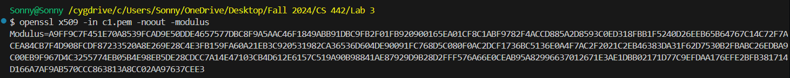

<p float="left">
  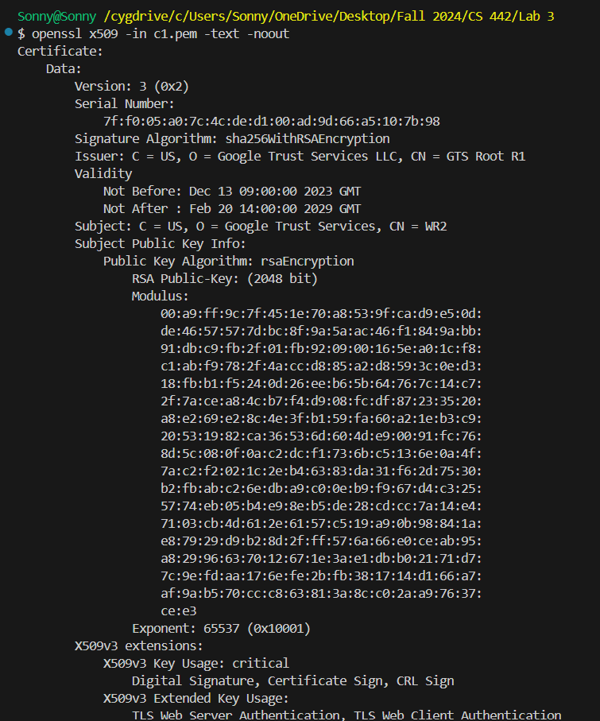
  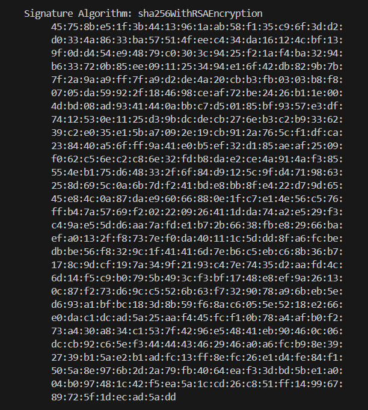
</p>
<p float="left">
  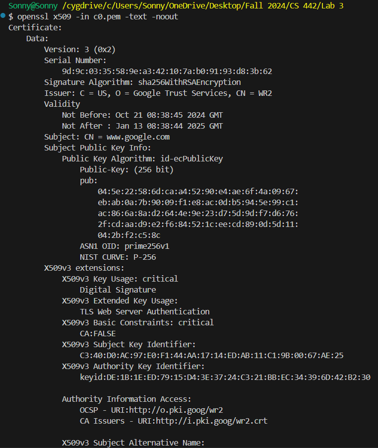
  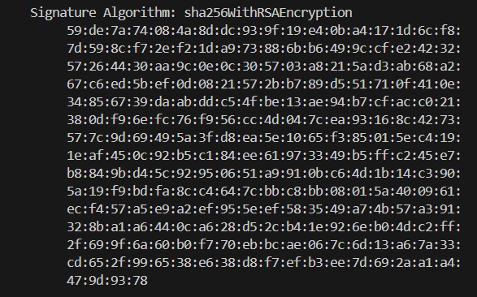
</p>

Next, I needed to extract the signature field from the server certificate. While there is no specific OpenSSL command to isolate the signature directly, I used the `openssl x509 -text` command to view the entire certificate and manually copied the signature portion. This required removing spaces and colons to format it correctly into a hex string for further processing. The output of this command was the signature in a format ready to be processed by my verification program.

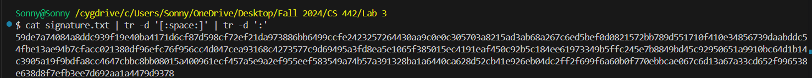

To compute the hash of the certificate body, I needed to exclude the signature block, as the signature was applied to the certificate's hash. Using the `openssl asn1parse` command, I extracted the body of the certificate by identifying the offset where the body begins and the signature block ends. I then used the `-strparse` option to isolate the body of the certificate, which I saved to a binary file for hashing:

<p float="left">
  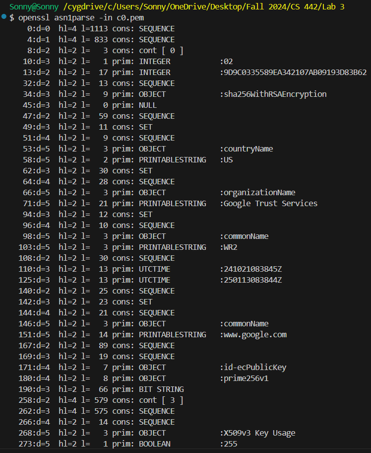
  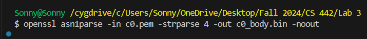
</p>

This binary file was then hashed using the `sha256sum` command:

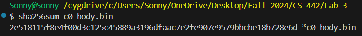

With the public key, signature, and certificate body hash in hand, I wrote a Python script to verify the signature using RSA decryption. The script involved using the PyCryptodome library to perform the RSA decryption, and I compared the decrypted signature against the certificate body hash. Despite numerous attempts and ensuring all the parameters were correctly formatted, the output consistently indicated that the signature was invalid. The decrypted value did not match the hash of the certificate body, leading to the conclusion that the signature was invalid. I also attempted a C implementation using OpenSSL to verify the signature, but encountered issues with deprecated functions in OpenSSL 3.0. The program compiled with warnings, but the result was the same — the signature failed to verify. Despite troubleshooting, the signature remained invalid.

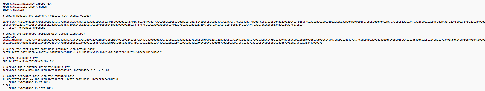

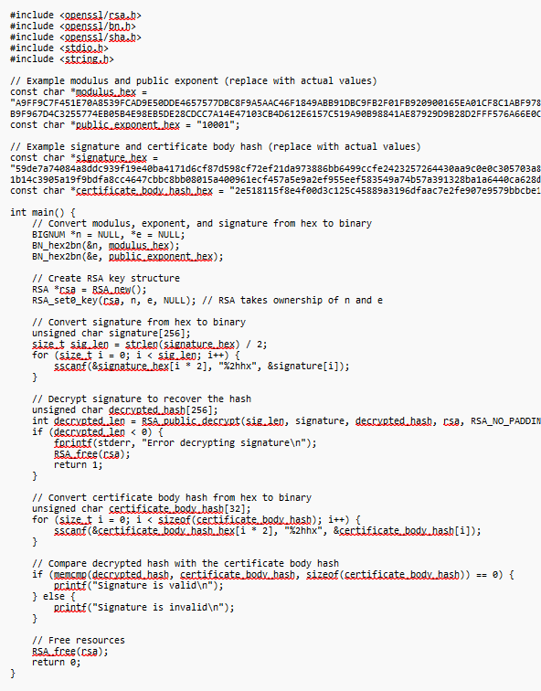

In conclusion, the process of manually verifying an X.509 certificate was challenging but informative. Despite extracting all the required fields — public key, signature, and certificate body — I was unable to validate the signature. The mismatch between the decrypted signature and the computed certificate hash suggested that the signature was invalid. While I encountered issues with both Python and C implementations, this task provided valuable experience with cryptographic verification and the complexities involved in handling certificate signatures manually.

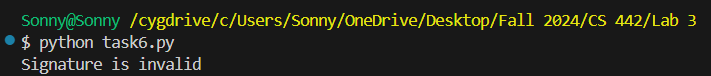

---

## Conclusion

The lab provided comprehensive, hands-on experience in implementing and analyzing the RSA cryptosystem, bridging theoretical knowledge with practical applications. Through tasks such as key derivation, encryption, decryption, digital signature generation and verification, and X.509 certificate validation, I gained a deeper understanding of the mathematical principles and real-world applications of RSA. The use of the OpenSSL library facilitated interaction with large numbers and reinforced the importance of precision in cryptographic operations. By completing these tasks, I developed critical skills in secure programming and cryptographic analysis, preparing me to apply public-key cryptography concepts in modern secure communication systems. This lab not only solidified foundational knowledge but also highlighted the practical relevance and challenges of implementing cryptographic algorithms in real-world scenarios.

---

## References

1. X. Yang, "CS 428/528/442/542 Lab requirements."
2. shiqiliu67, "InformationSecurity/Crypto_RSA LAB/task2.c at main · shiqiliu67/InformationSecurity," *GitHub*, 2020. https://github.com/shiqiliu67/InformationSecurity/blob/main/Crypto_RSA%20LAB/task2.c (accessed Nov. 21, 2024).
3. "SEED Project," *seedsecuritylabs.org*. https://seedsecuritylabs.org/Labs_20.04/Crypto/Crypto_RSA/
